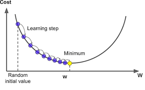
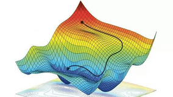

# Module 1: Math & Numpy :pencil:

Welcome to the first module of the second day, I hope you still have the motivation and determination to understand artificial intelligence. In this part, we will look at the mathematics behind supervised learning. This module is complicated for more IT than mathematical profiles but don't give up, we will soon see the use of frameworks that allow the abstraction of mathematics, but it is important to understand them to master the different frameworks.

# Before starting

Please do all installations in [this document](./SETUP.md)

## Math & Numpy :heavy_division_sign:

You are going to discover the Numpy library which allows you to work directly with arrays or multidimensional matrices. This is an important strength because you will see that our data always looks like a matrix.

After that you will discover the most emblematic algorithm of artificial intelligence, the gradient descent which simply allows our program to learn.

Gradient descent is an algorithm that allows us to find the minimum of a function.

Here is a simple example

We'll come and calculate our gradient using the derivative of the function and subtract it from our value, which will have the effect of bringing us closer to the minimum.

In this rather simplistic case, we can say that it is not so hard. But our cost function (which is the function whose minimum we are looking for) doesn't really look like that very often, a rather complex example

And still we are on a rather simple case, in artificial intelligence we often have hundreds of parameters for two on the example.

Good luck and courage!

## Submit :trophy:

Fill the notebook: ``Math-and-Numpy.ipynb``

To submit your work, think about pushing your changes. It is important to push so that we are able to assess participation.
If you have any concerns, talk to a supervisor.

## Resources :book:

 - [Numpy docs](https://numpy.org/doc/)
 - [Gradient descent explained in 3 steps and 12 drawings](https://www.charlesbordet.com/fr/gradient-descent/#ensuite)
 - [Gradient descent, how neural networks learn](https://www.youtube.com/watch?v=IHZwWFHWa-w)
 - [Gradient descent explained by MachineLearnia](https://www.youtube.com/watch?v=rcl_YRyoLIY)